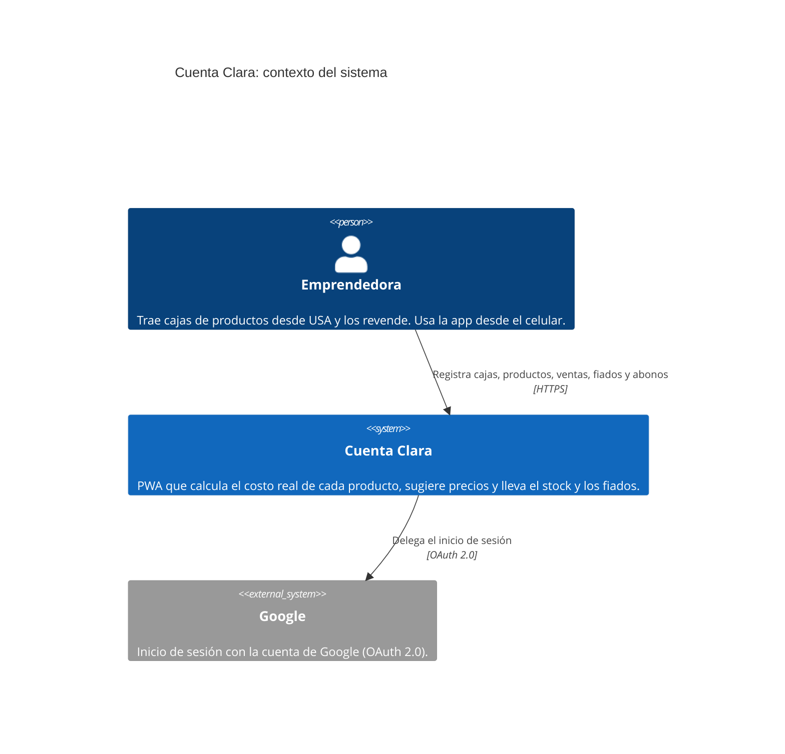
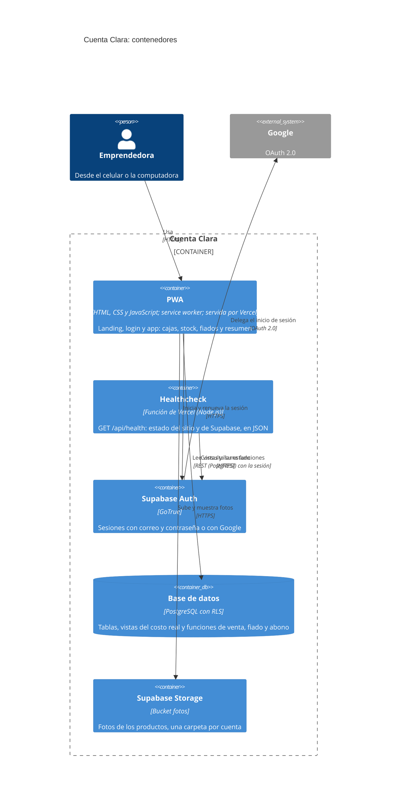
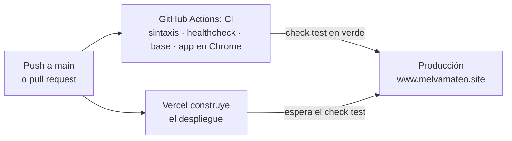
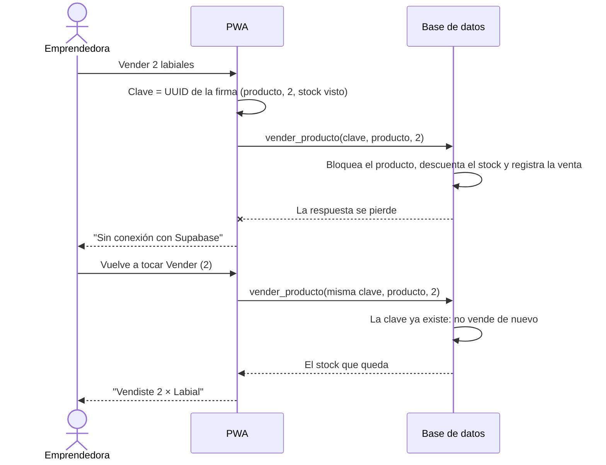

# Arquitectura de Cuenta Clara

Este documento describe la arquitectura de Cuenta Clara **como está construida hoy**, con el [modelo C4](https://c4model.com): el contexto (nivel 1) y los contenedores (nivel 2). Suma cómo se despliega y un flujo clave. Las decisiones que la explican están en los [ADRs](#6-decisiones-de-arquitectura-adrs).

[PLAN.md](../PLAN.md) es el plan inicial del capstone. Donde difieren, vale este documento.

## 1. Contexto (C4, nivel 1)

Quién usa el sistema y con qué sistemas externos habla.

- **Emprendedora:** la única usuaria de su cuenta. Cada cuenta ve solo sus datos.
- **Cuenta Clara:** el sistema completo, es decir, la PWA más su proyecto de Supabase (base, Auth y fotos).
- **Google:** opcional. También se puede entrar con correo y contraseña.

Las clientas que tienen fiados no usan el sistema: sus datos los carga la emprendedora.

## 2. Contenedores (C4, nivel 2)

Las piezas que se despliegan por separado y cómo se comunican.

| Contenedor | Tecnología | Responsabilidad |
|---|---|---|
| **PWA** | HTML, CSS y JavaScript sin compilación; service worker | Toda la pantalla: formularios, listas e indicadores. Genera la clave de cada operación. No calcula costos ni decide permisos. Funciona sin internet para consultar la última copia |
| **Healthcheck** | Función de Vercel | Dice si el sitio y Supabase responden: 200 `ok` o 503 `degraded`. No toca datos |
| **Supabase Auth** | GoTrue | Emite, valida y renueva la sesión (JWT); login con correo o Google |
| **Base de datos** | PostgreSQL | Datos, integridad, permisos (RLS), el cálculo del costo real (vistas) y las operaciones de varias filas (funciones idempotentes) |
| **Supabase Storage** | Bucket `fotos` | Fotos comprimidas en el celular, con el nombre que sale de su contenido |

Los scripts de la base están en [sql/](../sql/), con su propia guía en [sql/README.md](../sql/README.md).

## 3. Despliegue

- **Código y CI:** GitHub. Cada push corre las pruebas; `main` está protegida y un PR no se une sin el check en verde.
- **Sitio:** Vercel, con HTTPS, headers de seguridad (CSP y compañía) y la función de salud. Solo pasa a producción lo que tiene el check `test` en verde.
- **Base, Auth y fotos:** Supabase. Los cambios de estructura se aplican corriendo los scripts de `sql/` en orden; son idempotentes.

## 4. Un flujo clave: vender, con un corte de conexión

Muestra por qué cada operación lleva una clave ([ADR-2](adr/0002-escrituras-idempotentes-con-clave.md)).

## 5. Atributos de calidad

| Atributo | Cómo se logra |
|---|---|
| **Seguridad** | RLS por cuenta en todas las tablas; sin permisos para quien no tiene sesión; CSP y headers de seguridad; el portal no muestra nada hasta confirmar la sesión |
| **Integridad** | Operaciones idempotentes en transacciones; referencias atadas al mismo dueño; textos en forma canónica; montos con dos decimales |
| **Disponibilidad** | Service worker que abre la app sin internet con la última copia; healthcheck para detectar si Supabase no responde |
| **Mantenibilidad** | Una sola fórmula del costo, en la base; scripts de `sql/` idempotentes; pruebas automáticas en cada push |
| **Costo** | Todo corre en planes gratis: Vercel Hobby, Supabase Free y GitHub Actions |

## 6. Decisiones de arquitectura (ADRs)

| ADR | Decisión | Estado |
|---|---|---|
| [ADR-1](adr/0001-supabase-como-backend-con-rls.md) | Supabase como backend, con la seguridad de los datos en RLS | Aceptada |
| [ADR-2](adr/0002-escrituras-idempotentes-con-clave.md) | Escrituras idempotentes con una clave generada por la app | Aceptada |
